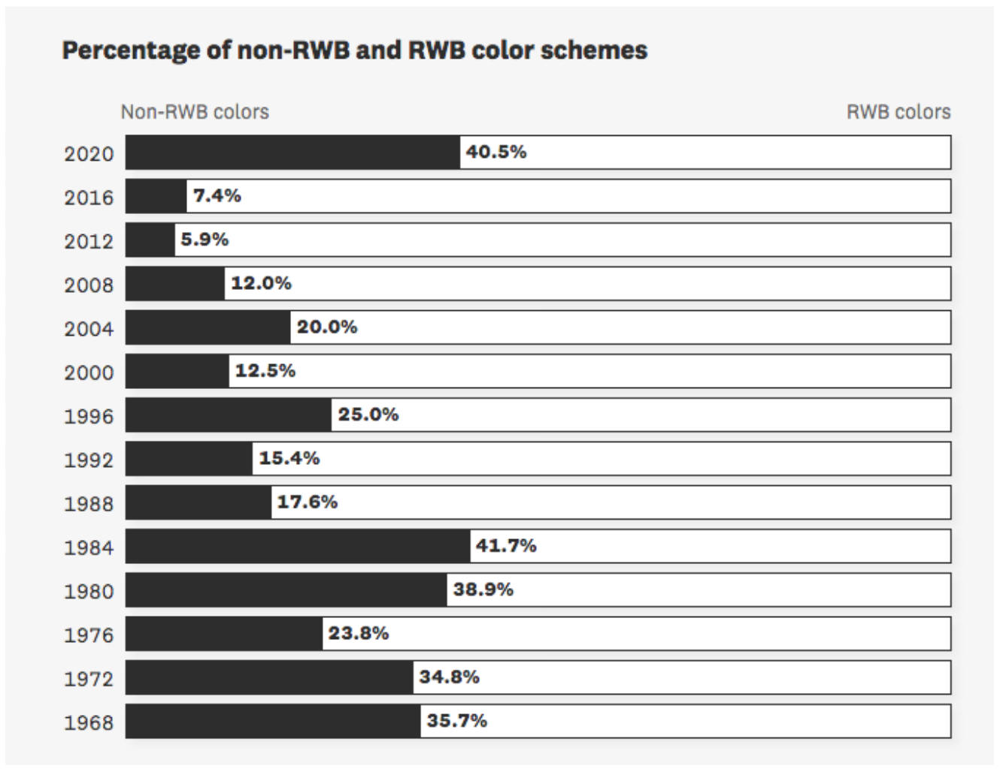
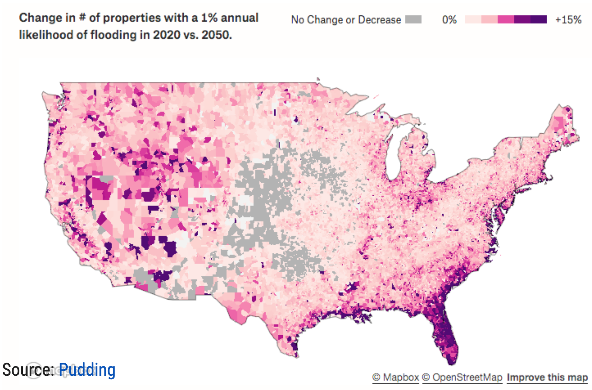
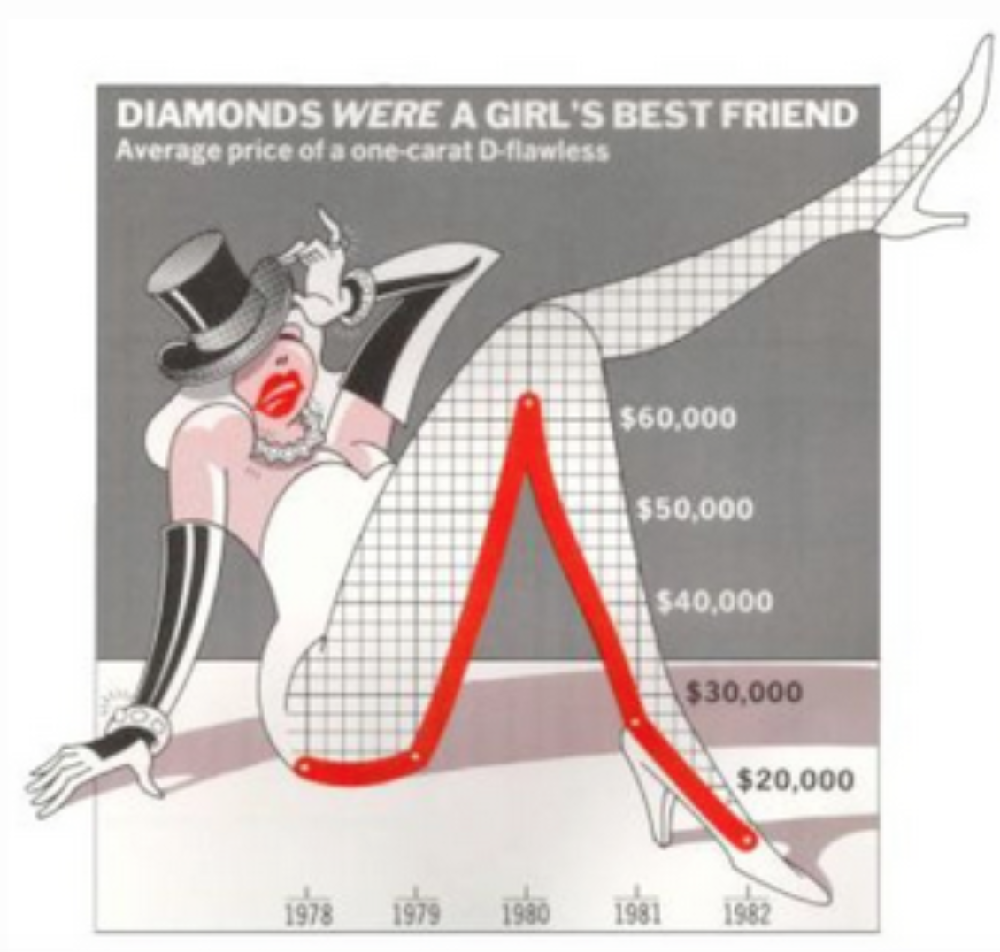

**Instruction:**
Provide critique and suggest improvements for a set of charts.

================================================================================================================

{width=50% height=300}

#### Review:
The horizontal histogram illustrates the percentage of non-RWB and RWB color schemes very clearly. First of all, it uses contrast colors for different groups. And secondly, it shows the percentage number to the right of the bars. However, the graph lacks a sense of purpose. It is hard to tell what conclusion the author wants us to reach. For example, it could be showing a discontinue on a generally decreasing trend for Non-RWB percentage or it could be showing the percentage of non-RWB returns back to 1984’s level. In either case, I would convert the graph to a vertical one with the earliest time on the far left, since it accords with most people’s sense towards sequential data, in this case time. I would then use a line chart to emphasize a trend and different colors to make 2020’s data stand out, if the author is trying to show a discontinue in 2020.

================================================================================================================

{width=50% height=300}

#### Review:
This graph shows the change in number of properties with a 1% annual likelihood of flooding in 2020 vs. 2050 at county level. I like the fact that it greys out non-interested areas and the use of strong contrast colors. But I am not sure about using five levels of hue. If it is necessary to differentiate a 12% increase with a 15% increase, then this system works fine. But if not, I think it would be better off to simplify the system into less levels. And again, depend on the purpose of the graph, it might be better to present the change at state level or some customized region level, because first, most deep color counties are close to each other, and second, it is hard to locate a specific county from a complete countrywide map.

================================================================================================================

{width=50% height=300}

#### Review:
This graph shows the average price of a one-carat D-flawless with a line chart. I like it uses a red line to strengthen the actual line. But the coordinate is not very clear. There are too many unnecessary lines in the incomplete 2-d plane. To improve it, I would use a thicker black line to mark each price level, and take away or weaken some unnecessary lines.

================================================================================================================

{width=50% height=300}

#### Review:
This graph shows the favorite and least favorite color for different age groups. Although I like the idea of using paper-cut for each age group, it is too visually busy. And the proportion and position of each color are also confusing, because it fails to illustrate whether an order is present. To improve the graph, I would keep only one group of paper-cuts and use them as x labels, together with the number, and use a vertical histogram to clearly represent what percentage of people favors each color in different age groups. The favorite and lease favorite histogram can also be combined by placing favorite data on the positive half of y axis, and lease favorite data on the negative half.
